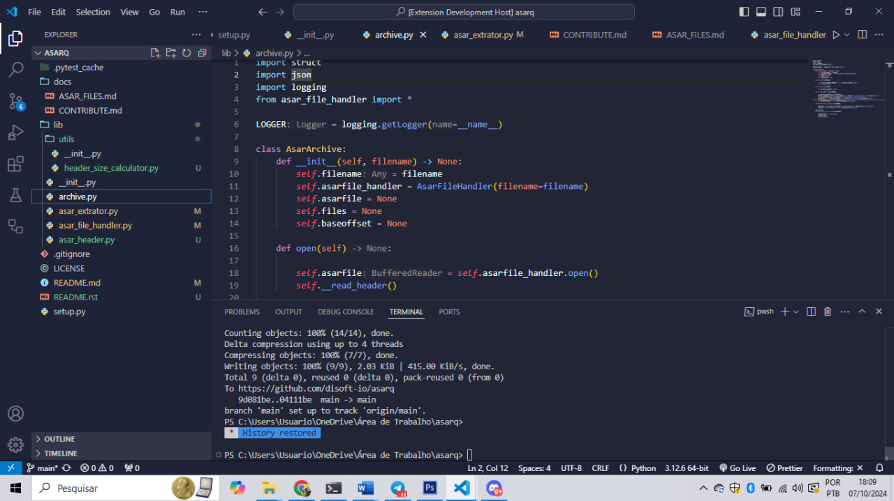

# sheep-themes 

  
   

A collection of dark themes to make your day more productive and happy, with colors strategically designed to not give you a headache in the future. 

## Contribute

That said, there's a bunch of ways you can contribute to this project, like by:

* ⭐ Giving a star on this repository (this is very important and costs nothing)
* 🪲 Reporting a bug
* 📄 Improving this documentation
* 🚨 Sharing this project and recommending it to your friends

## How can I make a custom theme for vscode?

In this link in this article you will learn from scratch how to make a theme for vscode, from installing yo code, to the final part of editing the theme. [How to make a custom theme for your vscode](https://dev.to/brunociccarino/how-to-make-a-custom-theme-for-your-vscode-3e4a)

**Enjoy!**
